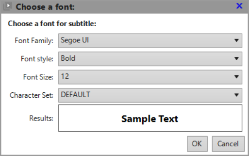

# **Color Chooser Window**

This window is used to define the font of the subtitle or OSD text. 
The screenshot below depicts the case defining the subtitle text font.

To define the desired font, you need to manually selct:

- The *font family*, such as Arial, Calibri, Segoe etc... 
	:bulb: The related dropdown will always contain all the fonts installed on your system.

- The *font style*, such as Regular, **Bold**, *Italic*, ~~Strikeout~~, or combinations such as ***Bold, Italic*** 
	:bulb: The related dropdown contains all possible font style combinations.

- The *font size* in pixels (i.e. the height of a capital letter)

- The *character set* to use, such as EAST_EUROPE, GREEK and so on. 

 The *Results* box provides a preview of the text that will be for subtitle or OSD
after you confirm your selection with the OK button or with the Enter key.

To leave the existing font as-is, just click Cancel or hit the Escape key.

## **How to choose the correct character set**

It is important that the character set is selected to match with the subtitle or OSD language. 
If a bad character set is selected, then some characters may be rendered as squares or some jibberish 
characters in the subtitle or OSD.

* The OSD language is always the application language as selected in the Settings General tab.
	- If you use English, French or German, then you *can* use DEFAULT character set for OSD (but, using any other character set will do no harm);
	- If you use Romanian, then you *must* use EAST_EUROPE character set for OSD.
	
* For subtitles, you should choose the character set corresponding to the subtitle language that you use. For example:
	- If you use subtitles in any Eastern Europe language based on the Latin alphabet (such as Romanian, Czech, Slovak, Slovenian, Polish, Hungarian, etc.), then the subtitle character set should be EAST_EUROPE;
	- If you use subtitles in a language based on the Kyrilic alphabet (e.g. Russian or Bulgarian), then you should select the RUSSIAN character set;
	- Obviously, if you use Greek subtitles, your subtitle character set should be GREEK, and so on.

:bulb: Using a non-DEFAULT character set does not break the English/French/German text for subtitles or OSD. 
So if you use e.g. EAST_EUROPE for subtitles, you can still watch movies with English/French/German subtitles, 
without any problems.
