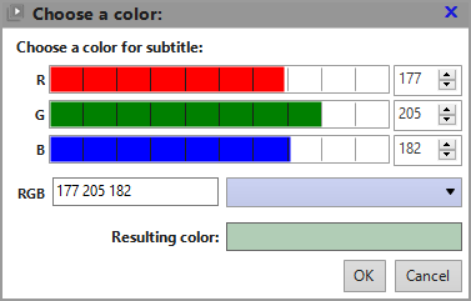

# **Color Chooser Window**

This window is used to define the color of the subtitle or OSD text. 
The screenshot below depicts the case defining the subtitle text color.

To define the desired color, you have several options:

1. Define the color's primary RGB components:
	- Click with the mouse inside of the R/G/B sliders, or ...
	- Drag these sliders to the desired position, or ...
	- Type the individual values of the R/G/B components, in range [0..255], in
	their corresponding box, or ...
	- Type the whole RGB value, in format (RRR GGG BBB), in the RGB box.

	:bulb: *The higher the RGB values, the more bright is the resulting color. 
	For example, (255 255 255) is white, while (000 000 000) is black.*

2. If you have no idea on which RGB values you should use, you can try using the 
color dropdown on the right side of the RGB box, to select one of the many 
pre-defined system colors.

 The *Resulting Color* box provides a preview of the color that will be used 
after you confirm your selection with the OK button or with the Enter key.

To leave the existing color as-is, just click Cancel or hit the Escape key.